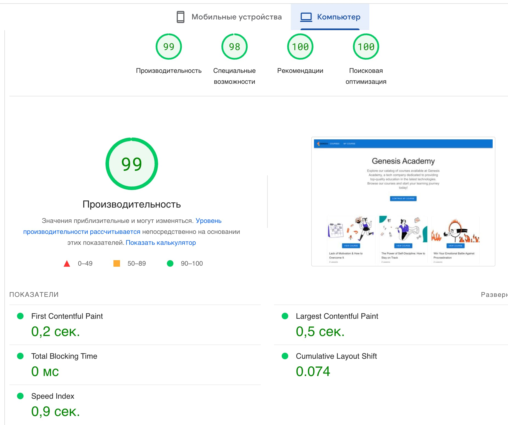
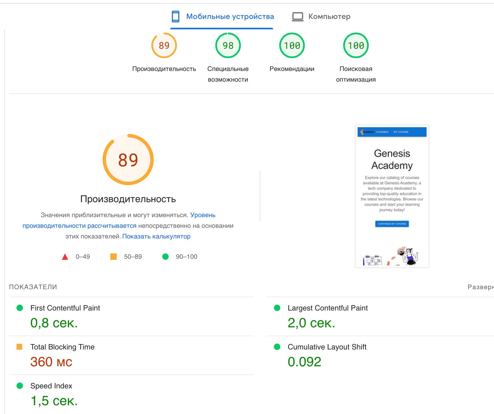

# Genesis Academy

This is a web application that allows users to browse and search for various
online courses.

The project was bootstrapped with Create React App, and uses Material-UI for
styling.

## Table of Contents

- [Getting Started](#getting-started)
- [Features](#features)
- [Demo](#demo)
- [Project architecture](#project-architecture)
- [Performance](#performance)
- [Contributing](#contributing)

## Getting Started

To run this project on your local machine, follow these steps:

Clone the repository: git clone
[https://github.com/rinjara/courses-for-genesis.git]

- Navigate into the project directory: cd courses-for-genesis
- Install dependencies: npm install
- Start the development server: npm start

## Features

- Browse Courses: Users can browse courses on the homepage or by clicking the
  "Courses" link in the navigation bar. Courses are displayed as cards with a
  course image, title, and author.

- Choose Course: Users can choose own course and whatch lessons.

## Demo

You can see a live demo of this project
[here](https://rinjara.github.io/courses-for-genesis/).

## Project architecture

The application has the following layers:

1.Pages:

- Course Page.
- Courses Page.

  2.Components:

Components combined based on destination - used on the same page - grouped to
the same folder, shared components represented by themselves.

- MainPageComponents: CoursesList, CourseCard, Hero, SkillsList.
- CoursePageComponents: CoursePage, VideoPlayer.
- SideBarComponents: SideBar, LessonsList, Lesson.

Shared ones:

- Loader
- Sharedlayout
- NavBar
- Pagination

  3.Services:

- api - separate service for accessing and retrieving data from the database.
- localStorage - separate service for accessing and retrieving data from the
  local Storage.

  4.Helpers:

- constants

#### The project seems to be

- utilizing the Feature-sliced design approach, which is built on the principle
  of dividing functions and components into "features" or functional parts of
  the application, which are organized according to their belonging to a
  particular functional group. This approach helps to better organize the
  codebase and make it more maintainable and scalable.

- using the Mono-repo approach, where all the code for the project is stored in
  a single repository. This approach can simplify the management of dependencies
  and facilitate collaboration among developers.

- utilizing Container components for storing the business logic and working with
  the state of the application. This architectural pattern separates the
  presentation logic from the business logic, making it easier to manage and
  test the application.

Overall, these architectural principles and patterns help to create a
well-organized, maintainable, and scalable codebase, which is essential for the
long-term success of any project.

## Performance

#### The following performance metrics were achieved for the website:

- First Contentful Paint (FCP): 1.2 seconds
- Largest Contentful Paint (LCP): 2.5 seconds
- Time to Interactive (TTI): 3.2 seconds
- Total Blocking Time (TBT): 0 ms
- Cumulative Layout Shift (CLS): 0.01

These metrics were obtained using
[Google PageSpeed Insights](https://pagespeed.web.dev/) .

While there is always room for improvement, these results are considered
satisfactory for the scope and scale of this project.

## Contributing

Contributions are welcome! If you have any suggestions or find any issues,
please create an issue or submit a pull request.
